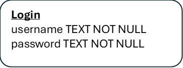

# Simple Login System with Python & SQL tools
Simple Login and Sign Up project with Python and SQL tools

This project demonstrates my proficiency in Python scripting language and SQL database management, utilising the SQLite database and importing the sqlite3 module for establishing connections, executing table operations, and running query.

### Data Modelling
In this project only a single table is generated, as all data will be stored exclusively in this table. The only information needed from the user are their username and password.

### Preview of the code
login_system.py is initially first executed to establish the connection to the SQLite database, ensuring that the table is ready and SQL query can be executed smoothly.

The image below displays the SQL commands utilised for creating the login table, the necessary user input data, and the SQL query needed to retrieve data from the table.

The image below illustrates a section of Python code that showcases the creation of the database file and the connection between the login_system.py file and the login_app.py file.

### Preview of login_app.py file
Upon the creation of the database from the login_system.py file, the login_app.py is then executed.

Below image is a sample of the Python code, which helped run the login_app.py file successfully.

Once login_app.py is run, the menu below will be shown, giving the user the opportunity to input their selection.

Sample of a scenario
A user enter 1 to login but the username and password is not found

The user then enter's 2 to sign up with new username and new password, which is then stored in the SQLite database.

After the user signed up, the user then enter's 1 to login and this time the application gets the credentials from the SQLite database.

To view the complete code, kindly refer to [login_system.py](login_system.py) and [login_app.py](login_app.py)