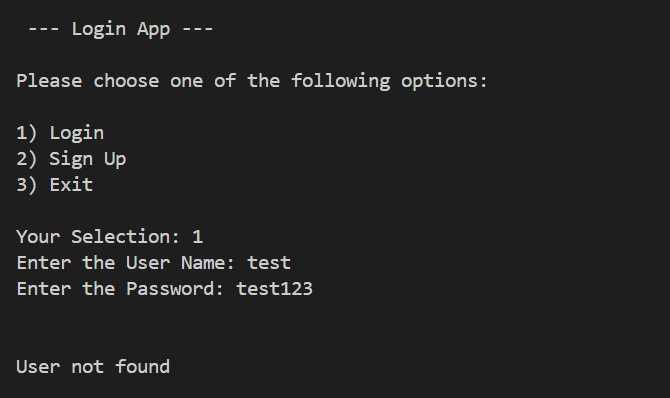

# Simple Login System with Python & SQL tools
Simple Login and Sign Up project with Python and SQL tools

This project serves as a showcase of my skills in Python scripting language with SQL database management.

The SQLite database is specifically used for this project, with sqlite3 module being imported as a connection, executing table and queries.

### Data Modelling
In this project only one table was created as the data will only be stored in that table and the only data required from user are username and password. 

### Preview of the code
login_system.py is first executed to get the connection to the SQLite database ready for table and establised SQL queries.

Below are the SQL command that are used to execute the creation of the login table, the required data that user will be inputting and SQL query that will be required to get the data from the table.

Below image shows a part of Python code that demostrate how the database file is created and the connection between the login_system.py file to login_app.py file works.

### Preview of login_app.py file
login_app.py is then executed after the database is created from login_system.py file.

Below image is a sample of the Python code, which helped run the login_app.py file successfully.

When the login_app.py is executed the below menu will be displayed to allow the user to input the option.

Sample of a scenario, a user enter 1 to login but the username and password is not found

The user then enter's 2 to sign up with new username and new password, which is then stored in the SQLite database.

After the user signed up, the user then enter's 1 to login and this time the application gets the credentials from the SQLite database.

To view the complete code, kindly refer to [login_system.py](login_system.py) and [login_app.py](login_app.py)